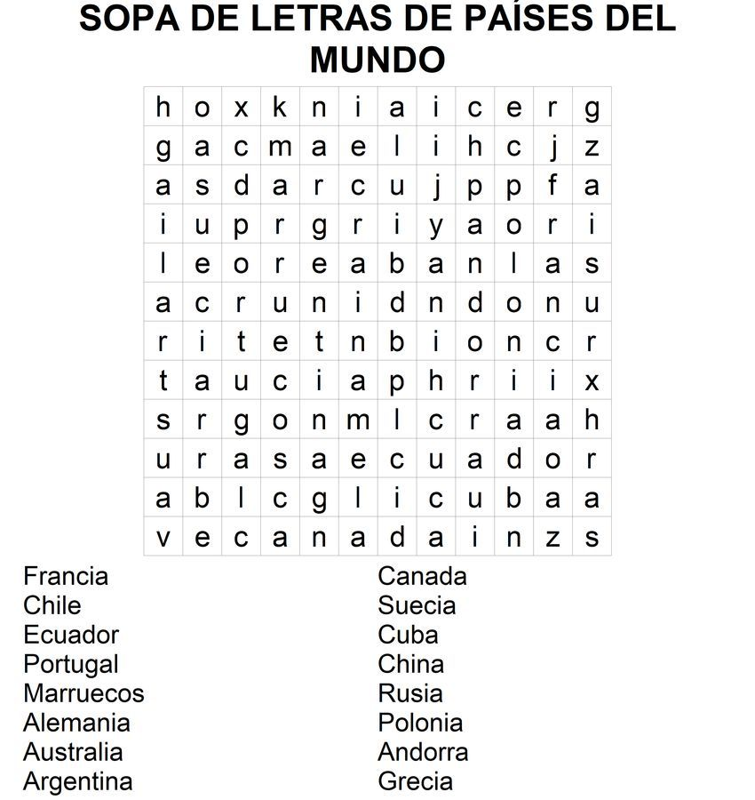

# Sopa de letras

*© F.J. Madrid Cuevas (fjmadrid@uco.es)
Estructuras de Datos. Grado de Ingeniería Informática. Universidad de Córdoba. España*

## Objetivos

- Aprender a implementar el TAD Trie.
- Aprender a usar un Trie para resolver una sopa de letras.
- Aprender a usar el tipo std::map
- Aprender a usar el tipo std::pair
- Aprender a usar el tipo std::stack
 
## Descripción

Un Trie [1] es un árbol multicamino especializado en recuperar las claves almacenadas basándose en prefijos. En un Trie todo nodo (salvo la raíz) representa un prefijo de clave formado por el camino desde la raíz a dicho nodo y el subárbol que tiene a dicho nodo como raíz almacena todas las clave que tienen como prefijo el definido por el nodo raíz.
Vamos a sacar partido de esta cualidad para resolver de forma eficiente una sopa de letras.
Como ya sabes, una sopa de letras es un tipo de puzle formado por una cuadrícula rellena con letras, de forma que, un número de palabras conocidas están contenidas en la cuadrícula siguiendo una secuencia lineal de casillas, sin que una casilla pueda estar compartida por dos o más palabras. El resto de casillas se rellenan con letras de forma aleatoria para “ocultar” a las palabras a buscar (ver Figura 1).
El juego consiste en localizar las palabras en el menor tiempo posible. La Figura 1 muestra un ejemplo de sopa de letras.

||
|:--|
|**Figura 1.** Un ejemplo de sopa de letras. Se trata de localizar todas las naciones listadas. en la cuadrícula en el menor tiempo posible. Obtenida de: https://pasatiemposimprimibles.blogspot.com/2019/05/sopa-de-letras-de-nombres-de-paises-del.html|

Para resolver la sopa de letras, lo primero que tenemos que hacer es crear un Trie insertando la lista de palabras a buscar como claves del Trie.
Lo segundo sería ir recorriendo la cuadrícula (por filas y columnas), consultando en el Trie si la letra de dicha cuadrícula es prefijo de alguna de alguna clave. Si es así aplicamos el algoritmo `scanCell` para analizar de forma recursiva la tabla a partir de una celda siguiendo un prefijo de clave. Este algoritmo comienza o continua un escaneo a partir de la celda `(row, col)` siguiendo la dirección `(dy, dx)`. El resultado se almacena en un `Par` cuyo primer item es la palabra clave encontrada y el segundo item es una pila con las coordenadas de las celdas de la sopa donde está dicha la palabra clave.

    Algorithm scanCell(row:Int, col:Int, dx:Int, dy:Int, trie:Trie, 
                        soup:AlphabetSoup, result:Pair[String, 
                        Stack[Pair[Int,Int]]])
    //1. If the trie's prefix is a key then
    //   a word is found. Save the key as the first item of the scan_result
    //   pair and return from this level of recursion.
    //2. Else, we can two cases:
    //2.1.1 (dx==dy==0) The cell (row,col) is the first letter of a word.
    //      If there is a sub-trie whose prefix is this symbol, start a new
    //      recursive scanning of the 3x3 neighborhood from this position
    //      using this sub-trie.
    //2.1.2 (dx!=0 or dy!=0) The cell (row,col) is the next letter of a
    //      started scanning following the direction (dx,dy). If there is a
    //      sub-trie whose prefix is this symbol, continue the scanning
    //      following the direction (dx,dy) recursively.
    //2.2 After recursion comes back, if a word was found (first item of
    //    the scan_result pair != ""), push the current cell's coordinates
    //    (row,col) into the second item of scan_result (the stack of
    //    coordinates).

Así si utilizamos la sopa de la Figura 1, cuando estudiemos la celda (9,5) con valor ‘e’, el Trie dirá que hay un prefijo ‘e’ (prefijo de clave ‘ecuador’) y pasaremos a llamar a nuestro algoritmo de escaneo del entorno de la celda (dy=0, dx=0) y usando el sub-trie con prefijo “e”.
De esta forma (como (dy=0, dx=0) se procederá a escanear ahora para el rango rows={8,9,5} x cols={4,5,6} (salvo la central (9,5)).
En este proceso al estudiar la celda (9,6) con valor ‘c’, el trie indica que hay un sub-trie con prefijo prefix()+“c”, por lo que se aplica de forma recursiva el algoritmo sobre el este sub-trie (representa el prefijo “ec”) a partir de la celda (9,6) con dirección dy=(9-9)=0 y dx=(6-5)=1.
Observa cómo a partir de la segunda letra encontrada (“c”), la dirección (dy=0,dx=1) indica ya la dirección a seguir para el resto de la palabra, es decir, en el resto de llamadas recursivas ya sólo se estudiarán las celdas (9+dy=9, 6+dx=7)=”u”. (9+dy=9, 7+dx=8)=”a”, … ,  y se repite el proceso hasta que se llega a un trie cuyo prefijo es clave (“ecuador”) pasando a inicializar el primer item del Par scan_result a “ecuador” indicando esto que se ha encontrado una palabra. Ahora antes de retornar de un nivel de recursión si se ha encontrado una palabra hay que apilar las coordenadas (row,col) de este nivel en la pila almacenada como segundo item del Par scan_result.

## Detalles de implementación.

Para representar el diccionario que asocia símbolo con nodo hijo vamos a utilizar el tipo std::map [2].
Para devolver el resultado de un escaneo de una palabra usaremos el tipo std::pair [3] de una cadena std::string y una pila std::stack [4]. La pila almacena a su vez pares (std::pair) de enteros (fila,columna) con las coordenadas de la rejilla para cada letra de la palabra encontrada.
Para plegar/desplegar el símbolo que asocia un nodo padre con un nodo hijo vamos a utilizar una codificación en hexadecimal [5] codificando el código del símbolo con un entero sin signo de 16 bits [6].

## Evaluación

|Test | Puntos |
|:--- | :--- |
|`test_trie_node tests_trie_node` | 2 |
|`test_trie_node tests_trie_node_fold_unfold` | 1 |
|`test_trie tests_trie` | 2 |
|`test_trie tests_trie_fold_unfold` | 1 |
|`test_trie tests_retrieve` | 2 |
|`test_alphabet_soup_solver tests_alphabet_soup` | 2 |

## Referencias

[1] Trie: en.wikipedia.org/wiki/Trie
[2] std::map: http://www.cplusplus.com/reference/map/map/
[3] std::pair: https://www.cplusplus.com/reference/utility/pair/pair/
[4] std::stack: http://www.cplusplus.com/reference/stack/stack/
[5] Manipuladores de flujo: https://www.cplusplus.com/reference/library/manipulators/
[6] Tipos estándar para enteros: https://www.cplusplus.com/reference/cstdint/
